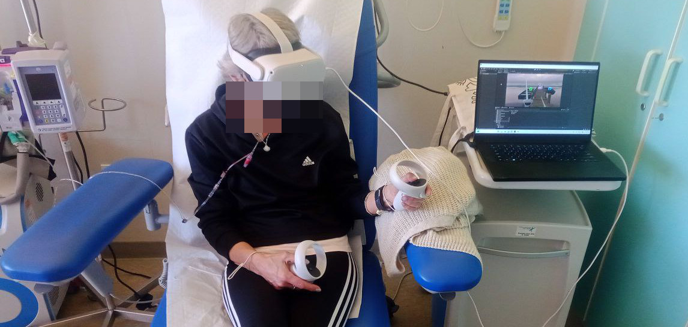

<!--img class="circle" style="float: left; margin-right: 10px; margin-top: 10px;" src="https://github.com/iacopomasi/iacopomasi.github.io/blob/master/imgs/iacopomasi_res.jpg?raw=true"-->
<!--Ciao,
Welcome · Benvenuto · خوش آمدید · 欢迎 · Bienvenida · ようこそ · ברוך הבא · ترحيب · Accueil · Chào mừng · 歓迎 · добро пожаловать · Willkommen · स्वागत · 환영 · Boas-vindas · kuwakaribisha to my web-page!
I am **Associate Professor** at the **University of Rome, La Sapienza**. Till August 2022, I was also **Adjunct Research Assistant Professor** at the **University of Southern California (USC)**. I am also a researcher interested in computer vision and machine learning. I'd like to answer the question: _"How can we teach machines to see like humans do?"_

### I do not like to be formal but what about a formal, brief bio?
Dr. Iacopo Masi is Associate Professor in the Computer Science Department at [Sapienza, University of Rome](http://www.uniroma1.it). Till August 2022, I was also Adjunct Research Assistant Professor in the Computer Science Department at the [University of Southern California (USC)](http://www.usc.edu). Previously Dr. Masi was Research Assistant Professor and Research Computer Scientist at the [USC Information Sciences Institute (ISI)](http://www.isi.edu). Dr. Masi earned his Ph.D. degree in Computer Engineering from the University of Firenze, Italy. Immediately after, he moved to California and joined USC, where he was a postdoctoral scholar. Dr. Masi has been Area-Chair of several conferences in computer vision (WACVs, ICCV'21, ECCV'22) and currently serves as Associate Editor for The Visual Computer - International Journal of Computer Graphics. He organized an International Workshop on Human Identification at ICCV'17 and was Workshop Chair at SIBGRAPI'18. Dr. Masi was awarded the **prestigious Rita Levi Montalcini award** by the Italian government in 2018. Dr. Masi's main research interest lies in solving the computer vision problem. His background covers topics such as tracking, person re-identification, 2D/3D face recognition, and modeling, adversarial robustness, and facial manipulation detection.
-->

### Welcome

Welcome to our research lab, a place where Computer Science meets Psychology! Our lab is the result of a productive collaboration between the <a href="https://www.di.uniroma1.it/en">Computer Science Department</a> and the <a href="https://web.uniroma1.it/dip38/home">Psychology Department</a> @ the Sapienza University in Rome. Our team of researchers works on creating intelligent technologies that can interact with humans in a more natural and intuitive way. By combining the latest advances in Computer Science and Psychology, we are able to develop innovative prototypes that can enhance Human-Computer Interaction in a variety of fields. Our lab focuses on a wide variety of research areas, including Artificial Intelligence, Psychometrics, Virtual Reality, and Data Analysis. We invite you to discover more about our lab and join us in shaping the future of Human-Centered technology!
